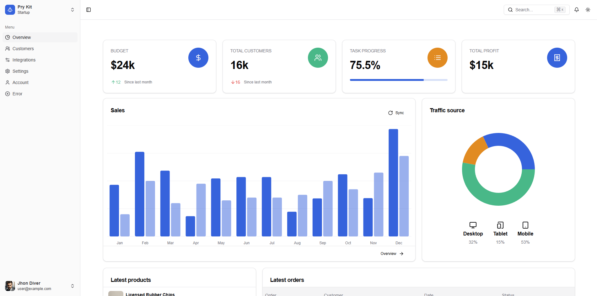

## [Pry Kit - Nextjs](https://shadcn-kit-nextjs.vercel.app/)


[](https://shadcn-kit-nextjs.vercel.app/)

## Pages

- [Dashboard](https://shadcn-kit-nextjs.vercel.app)
- [Customers](https://shadcn-kit-nextjs.vercel.app/dashboard/customers)
- [Integrations](https://shadcn-kit-nextjs.vercel.app/dashboard/integrations)
- [Settings](https://shadcn-kit-nextjs.vercel.app/dashboard/settings)
- [Account](https://shadcn-kit-nextjs.vercel.app/dashboard/account)
- [Sign In](https://shadcn-kit-nextjs.vercel.app/sign-in)
- [Sign Up](https://shadcn-kit-nextjs.vercel.app/sign-up)

## Quick start

- Clone the repo: `git clone https://github.com/fiqryx/shadcn-kit-nextjs.git`
- Make sure your Node.js and npm versions are up to date
- Install dependencies: `npm install` or `yarn`
- Start the server: `npm run dev` or `yarn dev`
- Open browser: `http://localhost:3001`

## File Structure

Within the download you'll find the following directories and files:

```
...
├── public
└── src
	├── assets
	├── components
	├── config
	├── hooks
	├── lib
	├── types
	├── stores
	└── app
		├── favicon.ico
		├── layout.tsx
		├── not-found.tsx
		├── (app)
		└── (auth)
```

## Reporting Issues:

- [Github Issues Page](https://github.com/fiqryx/shadcn-kit-nextjs/issues)


## License

- Licensed under [MIT](https://github.com/fiqryx/shadcn-kit-nextjs/blob/main/LICENSE)